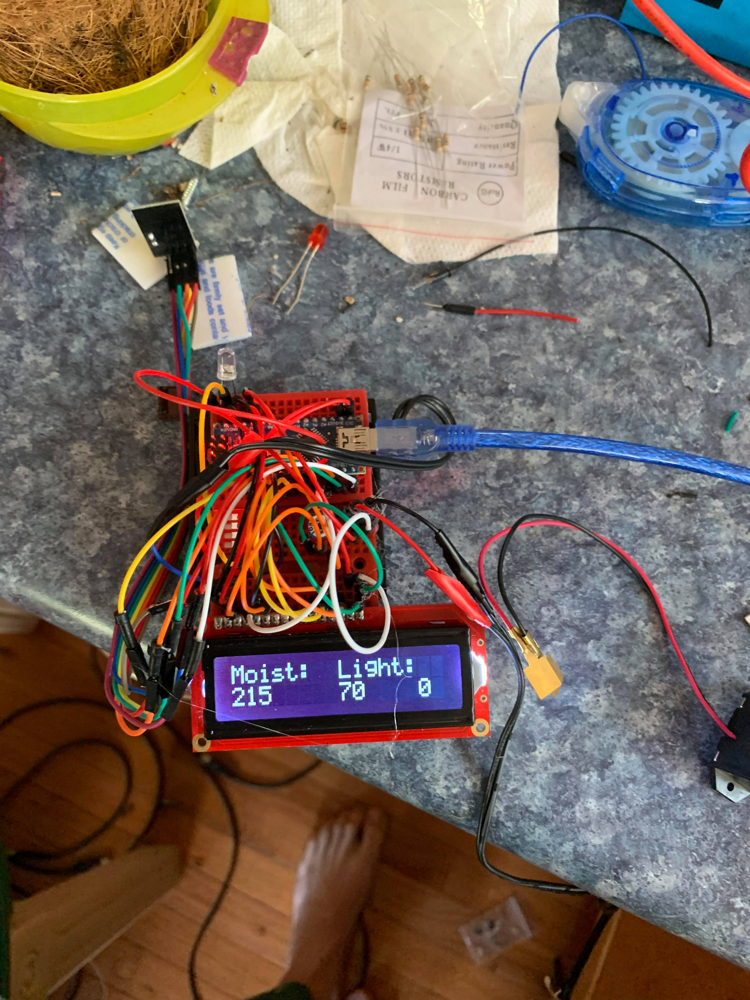

# Weather_Project

## Intro

Hey, what is this project all about?

Here's what it looked like at first:

 
 
## Wiring

Wiring setup as of 4-4-20:

Everthing pretaining to the plants and moisture sensor is taking place on the Arduio Mega, as it has numerous input/output pins.

The LCD display is hooked up to pins 22-27:

the LCD pin out is as follows (LCD pins start nearest the corner):

  
LCD:  Arduino:

  * 1     GND
  * 2     5v
  * 3     Potentiometer
  * 4     22
  * 5     GND
  * 6     23
  * 7     Empty
  * 8     Empty
  * 9     Empty
  * 10    Empty
  * 11    24
  * 12    25
  * 13    26
  * 14    27
  * 15    5v
  * 16    GND

The Moisture sensors have 1.25 in long and 5/8 in apart
One of the prongs goes to 5v the other goes to its analog pin and, through a 10k resistor, to GND

The wireless nrf24 is connected to the specialty SPI pins on the Arduino Mega. 
if the nrf24's pins were numbered as follows,
 ____________
|            |
|            |
|            |
|            |
|    1 2 3 4 |
|____5_6_7_8_|
Then the wiring is:
nrf24: Arduino:
1      Empty
2      51
3      10
4      3.3v
5      50
6      52
7      8
8      GND

The potentiometer that controls the printouts of the serial moniter is connected to pin A15

One of the light sensors prngs goes straight to ground. The other goes straight to pin A0, and through a 10k resistor to 5v.

The SparkFun RedBoard (RedBoard ia an Arduino Uno for all intents and purposes) is connected to the Arduino Mega by:
RedBoard: Mega:
VIN       5v
GND       GND
A5        21
A4        20

The RedBoard is connected to the SD card writing breakout board by:
SD:  RedBoard:
5v   5v
3v   Empty
GND  GND
CLK 13
DO  12
DI  11
CS  10

