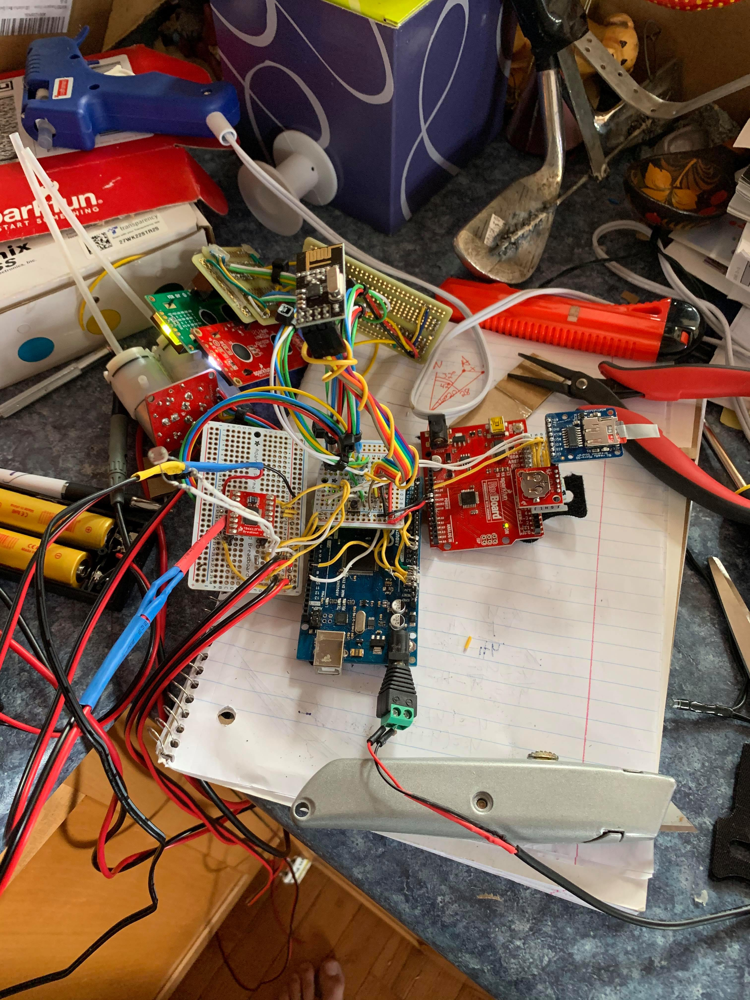
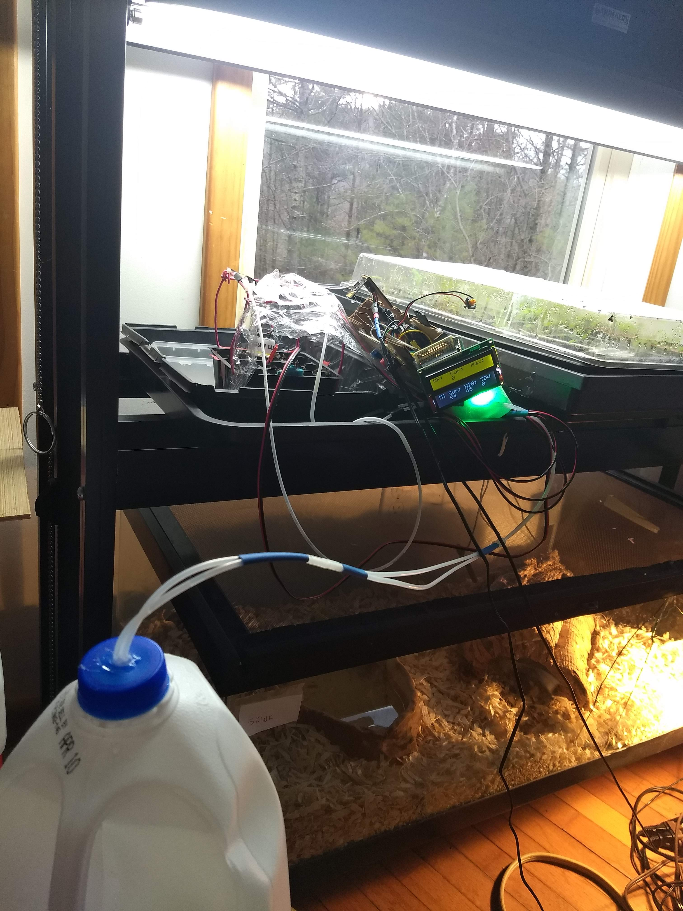

# Weather_Project

## Intro

The goal of this project was to create automated weather stations and plant waterers, from many basic parts, rather then off-the-shelf devices.

## Design Overview

Below is a conceptual view of this project.  The sensors take in data, display it on LCD screens and LED's, and log the data to an SD card for analysis later.  There is also a feedback loop where the moisture sensors determine when the water pump should be activated.

As of April 9, 2020, here is what the deployed system looks like:

The outdoor weather station:

The indoor main system, along with plants and watering system:

## Materials

  * Arduino Mega: https://store.arduino.cc/usa/mega-2560-r3
  * Arduino Uno: https://store.arduino.cc/usa/arduino-uno-rev3
  * Wireless transmitters and receivers: https://www.amazon.com/Makerfire-Arduino-NRF24L01-Wireless-Transceiver/dp/B00O9O868G
  * SD Card reader: https://www.adafruit.com/product/254

### Home made moisture sensor

Here's how I built this:

The moisture sensor is very simple. It consists of two metal prongs. I use 14 baud copper wire, that are spaced a consistant distance apart and in length. One of the prongs goes straight to 5v and the other goes atraight to the chosen analog input pin, and through a 10k resistor to ground. 

### Home made Wind Speed device

Instead of buying an off-the-shelf device for measuring wind speed, here's how we buiilt our own:

## Software

### Data Aquisition

Each of the *.ino files runs on a single board:

  * nrf24_reliable_datagram_receiver.ino: This runs on the Arduino Mega. This code takes in input from the moisture and light sensor.  It writes the data to the Sparkfun Red board, which in turn writes the data to an SD card. This code also receives the wireless data from the weather station.  It prints out all of the data it receives to one of two LCD displays, one for the weather station and one for the "garden" station. 
  * wire_receive.ino: This code runs on the Sparkfun RedBoard. The RedBoard is essentially an Arduino Uno (it is just produced by Sparkfun). This code receives the data written to it and then saves it to an SD card. The arduino Mega can't save the data due to limtations on the number of SPI ports it has. 
  * nrf24_reliable_datagram_transmitter.ino: This runs on the Weather Station's Arduino Uno. This receives data from the Weather Station's various sensors and then transmits the data wirelessly to the Arduino Mega.
  
The *.ino files are compiled and downloaded to their target boards using the Arduino IDE.

### Data Analysis

plotData.py will create plots for the different sensors logged onto the SD card.  See code for installation and usage.
Here's an example plot:

## Wiring

Wiring setup as of 4-4-20:

Everthing pretaining to the plants and moisture sensor is taking place on the Arduio Mega, as it has numerous input/output pins.

The LCD display is hooked up to pins 22-27:

the LCD pin out is as follows (LCD pins start nearest the corner):

  
LCD:  Arduino:

  * 1     GND
  * 2     5v
  * 3     Potentiometer
  * 4     22
  * 5     GND
  * 6     23
  * 7     Empty
  * 8     Empty
  * 9     Empty
  * 10    Empty
  * 11    24
  * 12    25
  * 13    26
  * 14    27
  * 15    5v
  * 16    GND

The Moisture sensors have 1.25 in long and 5/8 in apart
One of the prongs goes to 5v the other goes to its analog pin and, through a 10k resistor, to GND

The wireless nrf24 is connected to the specialty SPI pins on the Arduino Mega. 
if the nrf24's pins were numbered as follows,

Then the wiring is:

nrf24: Arduino:

  * 1      Empty
  * 2      51
  * 3      10
  * 4      3.3v
  * 5      50
  * 6      52
  * 7      8
  * 8      GND

The potentiometer that controls the printouts of the serial moniter is connected to pin A15

One of the light sensors prngs goes straight to ground. The other goes straight to pin A0, and through a 10k resistor to 5v.

The SparkFun RedBoard (RedBoard ia an Arduino Uno for all intents and purposes) is connected to the Arduino Mega by:

RedBoard: Mega:

  * VIN       5v
  * GND       GND
  * A5        21
  * A4        20

The RedBoard is connected to the SD card writing breakout board by:

SD:  RedBoard:

  * 5v   5v
  * 3v   Empty
  * GND  GND
  * CLK 13
  * DO  12
  * DI  11
  * CS  10

### Weather Station
The weather station has the same transmitter as the Arduino Mega.
However as the Weather t=station uses an Arduino Uno not a Mega, the SPI pins are different.

Then the wiring is:

nrf24: Arduino:

  * 1      Empty
  * 2      11
  * 3      10
  * 4      3.3v
  * 5      12
  * 6      13
  * 7      8
  * 8      GND

The transmitter kept getting unplugged so I soldered a small "sheild" for the Uno that holds its important wiring. This includes the wiring of the sensors and the transmitter irself. The homade anemoneter consists simply of a motor attatched to ground and an anlog pin. The enrire setup is housed in a yogurt container for wether proofing.

## Gallery

Here's what it looked like at first:

 
As of April 5 2020:

Weather station deployed, as of April 9:

Weather station board under construction:

Here is a close up of the entire system for watering the plants, along with pumps:

Here's the garden side deployed, as of April 9:

Here's a series of pictures showing how the final soldering was done in mid April:

Here's the final box that was made to contain the indoor station:

And finally here's the final deployed system at the end of April:

